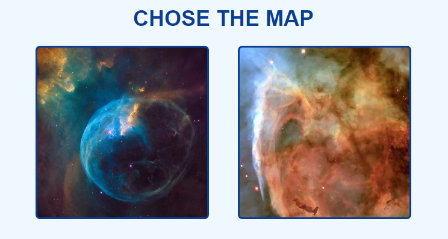
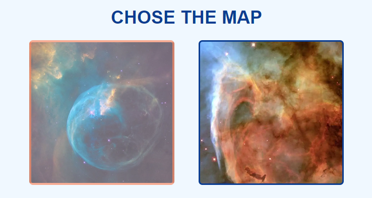
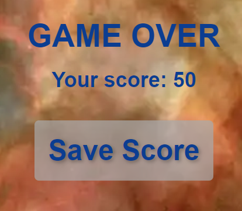

# GALACTIC SHOWDOWN

Galactic Showdown is a game for lovers of galactic battles. The user can select one of the sides: dark or light and has to destroy all enemy ships and none of their own. At the end of the game, the user gets a score which can be saved in the leaderboard.

The game can be accessed by this [link](https://bogdanovaiv.github.io/galactic-showdown/)

## Game Rules
First, you have to select one of the sides. The Light Side  has those ships:

The Dark Side  has those ships:

Second, you select the map where you will play.

You get 50 scores for your ships and 0 for the enemy ships. Click on the ship to shoot it. When you shoot your ship the number of your ships reduces, shooting the enemy ship adds the score of destroyed enemy ships.
The total score is calculated as your ships plus destroyed enemy ships.
The maximum score is 100.

## User Stories

__First Time Visitors To The Game__

- As a new visitor, I want to quickly understand how I can play this game to decide if it is interesting for me to stay on.
- As a new visitor, I want to get intuitive navigation.
- As a new visitor, I want to easily find the scores of other users.

__Returning Or Regular Visitors__

 - As a returning or regular user, I want to quickly find my score in the leaderboard.
 
 ## Features

### Existing Features

__The page "Home"__

- The page has the feature to select one of the sides. The selected side has an orange background.

- The button "side" has a hover effect: changing color.

- The user can select the map that is the background image of the game.

- The button "map" has a hover effect: changing opacity.

- The page has a section that is used to open the page "Leaderboard" where the user can find the list of user scores.

- The button "Leaderboard" has a hover effect: changing the color of the border.

__The page "Game"__

The page is the game place where the user plays. 

- It has a score bar where the user can find scores and the button "Home" that redirects to the page "Home".

- The button "Home" has a hover effect: changing opacity.

- The ships are created on the page and move down when their position goes off the page, they disappear.

- When the user clicks on the game place, call a sound effect. If this place contains a ship, call explosion sound effect, calculate scores and the ship disappears.

- At the end of the game, appear the message "Game over" with the user score and the button "Save" redirects to the page "Leaderboard".

- The button "Save score" has a hover effect: changing the color of the border.

__The page "Leaderboard"__

- The page has the button "Home" that redirects to the page "Home".

- The button "Home" has a hover effect: changing opacity.

- The page has two conditions:
  1. Display the score. The user can find the other user scores sorted by the score.

  
  
  2. Display and save the score. The user can find the other user scores sorted by the score and save their score.
  
  

  The button "Save" has a hover effect: changing color.

  
  
  ***Attention: the ability to save score is in development!!!***

