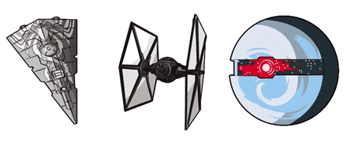
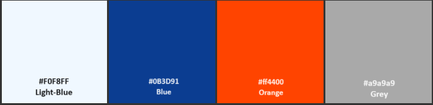

# GALACTIC SHOWDOWN

Galactic Showdown is a game for the fans of galactic battles. The user can select one of the sides - dark or light and has to destroy all enemy ships and none of their own. At the end of the game, the user gets a score which can be saved in the leaderboard.

The game can be accessed by this [link](https://bogdanovaiv.github.io/galactic-showdown/)

## Game Rules
First, you have to select one of the sides. The Light Side  has these ships:

The Dark Side  has these ships:

Second, you select the map where you will play.

You get 50 scores for your ships and 0 for enemy ships. Click on the ship to shoot it. When you shoot your ship the number of your ships reduces, shooting an enemy ship increases the score of destroyed enemy ships.
The total score is calculated as your ships plus destroyed enemy ships.
The maximum score is 100.

## User Stories

__First Time Visitors To The Game__

- As a new visitor, I want to quickly understand how I can play this game to decide if it is interesting for me to stay on.
- As a new visitor, I want to get intuitive navigation.
- As a new visitor, I want to easily find the scores of other users.

__Returning Or Regular Visitors__

 - As a returning or regular user, I want to quickly find my score in the leaderboard.
 
 ## Features

### Existing Features

__The Home page__

- The header has two buttons. The first is the Game Rules button that opens the Game Rules page where the user can read the instructions of the game. The second is the Volume button that turns on/off volume.

- The Game Rules button has a hover effect: changing color.

- The Volume button changes the image when the user clicks on it.

- The Volume button has a hover effect: changing color.

- The page has the feature to select one of the sides. The selected side has an orange background.

- The Side button has a hover effect: changing color.

- The user can select the map that is the background image of the game.

- The Map button has a hover effect: changing opacity.

- The page has a section that is used to open the Leaderboard page where the user can find the list of user scores.

- The Leaderboard button has a hover effect: changing the color of the border.

__The page "Game"__

The page is the game place where the user plays. 

- It has a special cursor.

- It has a score bar where the user can find scores, the Home button that redirects to the Home page and the Volume button which turns on/off volume.

- The Home button has a hover effect: changing opacity.

- The Volume button changes the image when the user clicks on it.

- The Volume button has a hover effect: changing color.

- The ships appear on the page and move down. When their position goes off the page, they disappear.

- When the user clicks on the game place, there is a sound effect. If this place contains a ship, there is an explosion sound effect, the score is calculated and the ship disappears.

- At the end of the game, there appears the Game Over message with the user score, and the Save button redirects to the Leaderboard page.

- The Save Score button has a hover effect: changing the color of the border.

__The Leaderboard page__

- The page has the Home button that redirects to the Home page.

- The Home button has a hover effect: changing opacity.

- The page has two conditions:
  1. Display the score. The user can find the other user scores sorted by the score.

  
  
  2. Display and save the score. The user can find the other user scores sorted by the score and save their score.
  
  

  The Save button has a hover effect: changing color.

  
  
  ***Attention: the ability to save score is in development!!!***

__The Game Rules page__

- The page describes the game rules and has the Home button and the Volume button. The buttons have the same function as on the Leaderboard page.

## Technologies Used

- HTML - There are different elements, attributes, and meta tags to structure content and optimize web pages for search engines. 
- CSS - It is used to style elements and create page layout, for animation and responsive design.
- Javascript - It is used to change HTML depending on parameters and create a game process.
- [Google Charts](https://developers.google.com/chart) - Google Charts is an online tool that is used to create charts and graphs. It is used to display the table of user scores.
- [Firebase](https://firebase.google.com/) - Firebase is a set of backend cloud computing services and application development platforms provided by Google. It is used to store user scores.
- [Obfuscator](https://www.obfuscator.io/) - A free and efficient obfuscator for JavaScript (including support of ES2022). Make your code harder to copy and prevent people from stealing your work. This tool is a Web UI to the excellent (and open source) javascript-obfuscator@4.0.0 created by Timofey Kachalov.
- [Github](https://github.com/) - It is used to store versions.
- [GitPages](https://pages.github.com/) - This resource deploys the websites.
- [ILoveImg](https://www.iloveimg.com/) - It is used to resize and shrink images.
- [Font Awesome](https://fontawesome.com/) - It is used to paste icons, improve appearance and for web-page functionality. 

## Design

## Color Scheme
  

  - The Light-blue is used for the background. It adds calmness and professionalism.
  - The Blue color is applied to a font color and other details. It creates contrast and provides good readability.
  - The Orange is used for a hover effect on some buttons. It creates an emphasized effect and provides good readability.
  - The Grey is used for the background of some buttons. It creates an emphasized effect, makes content more expressive and improves a visual user experience.

## Typography

Font YSText is used for text content as the first priority, which provides clarity and ease of perception and makes the text convenient to read. If YSText is unavailable, a browser will use Helvetica, then Arial, and finally standard Sans Serif to provide the capability of a wide range of devices and OS.

## Testing

Please refer to the [TESTING.md](TESTING.md) file for all test-related documentation.

## Deployment

 - The site was deployed to GitHub pages. The steps to deploy are as follows: 
 - In the GitHub repository, navigate to the Settings tab 
 - From the source section drop-down menu, select the Main branch
 - Once the Main branch has been selected, the page will be automatically refreshed with a detailed ribbon display to indicate the successful deployment. 

The live link can be found [here](https://bogdanovaiv.github.io/galactic-showdown/)

## Local Deployment

To deploy the project locally, clone the repository. You can do this by running the following command in your terminal:

`git clone https://github.com/BogdanovaIV/galactic-showdown.git`

## Future Improvements

 - Save the user score.
 - Add the ship level and change the number of shoots to destroy a ship depending on this level.
 - Add ships which can move horizontally.

## Credits 

### Content 

- The idea of ​​the game is taken from the movie Star Wars.
- The icons in the footer were taken from [Font Awesome](https://fontawesome.com/).

### Media

- The photos used on all pages are from [This Open Source site](https://pxhere.com).

- The audio used on all pages is from [This Open Source site](https://freesound.org/).

### Acknowledgments

- [Juliia Konovalova](https://github.com/IuliiaKonovalova/) was a great mentor who helped me to tap my potential and gave valuable advice.
- [The Code Institute team](https://codeinstitute.net/) supported me and provided all the information that I needed.
- [Firebase](https://firebase.google.com/) - provides a free option to get and store information.
- [Obfuscator](https://www.obfuscator.io/) - provides a free and efficient obfuscator for JavaScript (including support of ES2022).
- [GitHub](https://github.com/) provides free access to a versioning system.
- [ILoveImg](https://www.iloveimg.com/) provided me with a free service to compress images.
- [Remove](https://www.remove.bg/) provided me with a free service to remove the background.
- [Cut Audio](https://mp3cut.net/) provided me with a free service to cut audio.
- [Compress Audio](https://www.freeconvert.com/mp3-compressor) provided me with a free service to compress audio.
