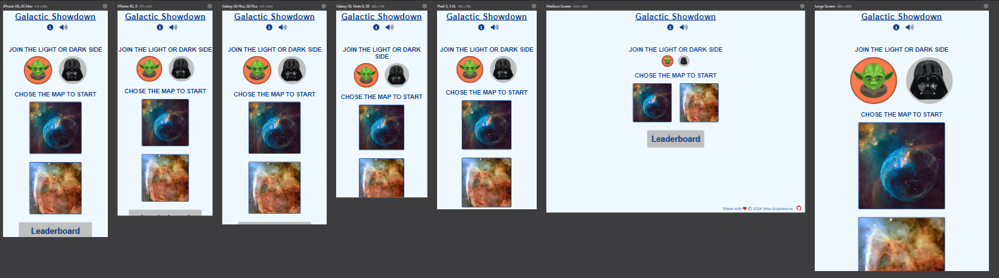
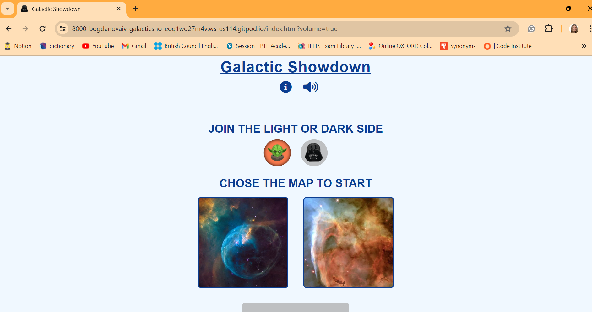
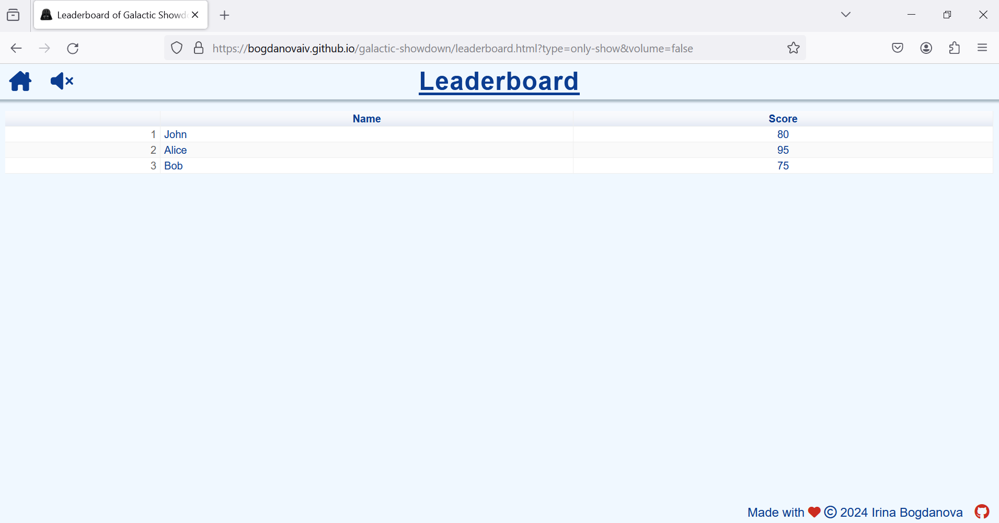
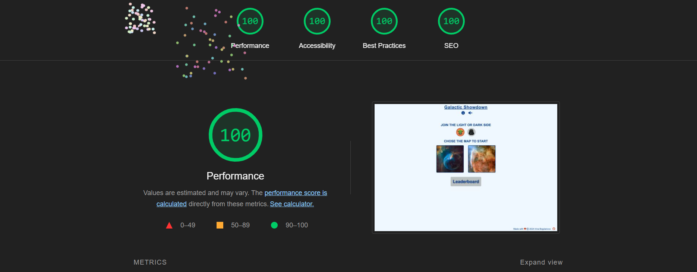
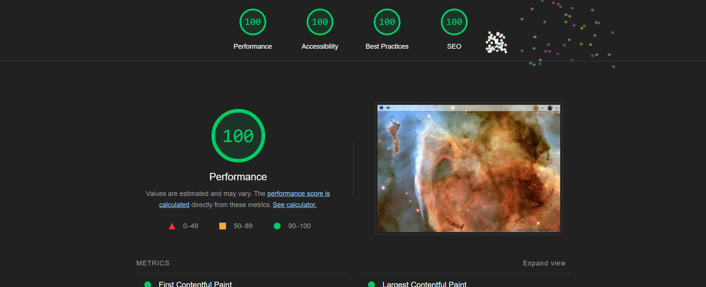
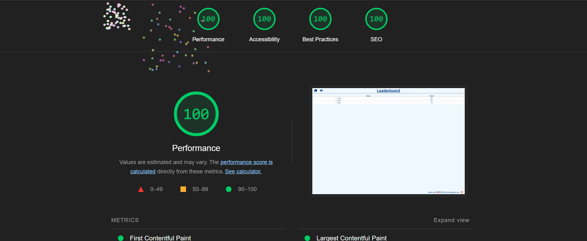

## TESTING

### Purpose Of Testing

The purpose of testing is to make sure the game does not have critical errors and works properly, providing a positive experience for the user.

### Testing Areas

__Functional Testing__

The opening of all pages and the correct operation of all links and buttons were tested. The navigation functions properly and the whole game process works correctly.

| feature | action | expected result | tested | passed | comments |
| --- | --- | --- | --- | --- | --- |
| The Home page | | | | | |
| The Game Rules button | Click on the Game Rules button | The Game Rules button opens the Game Rules page | Yes | Yes | - |
| The Game Rules button is hovered over on large devices | Hover over the Game Rules button | The Game Rules button changes color | Yes | Yes | - |
| The Volume button | Click on the Volume button | The Volume button turns on/off sound effects and changes the image| Yes | Yes | - |
| The Volume button is hovered over on large devices | Hover over the Volume button | The Volume button changes color | Yes | Yes | - |
| The Side radio button | Click on one of the radio buttons | the radio button changes color | Yes | Yes | - |
| The Side radio button is hovered over on large devices | Hover over the radio button | The radio button changes color | Yes | Yes | - |
| The Map button | Click on the Map button | The Map button opens the Game page with the chosen image and side | Yes | Yes | - |
| The Map button is hovered over on large devices | Hover over the Map button | The Map button changes opacity | Yes | Yes | - |
| The Leaderboard button | Click on the Leaderboard button | The Leaderboard button opens the Leaderboard page with the parameter "view only" | Yes | Yes | - |
| The Leaderboard button is hovered over on large devices | Hover over the Leaderboard button | The Leaderboard button changes the color of the border | Yes | Yes | - |
| The Game page | | | | | |
| The page uses a special cursor | The page uses a special cursor | The cursor is changed on a target image | Yes | Yes | - |
| The Home button | Click on the Home button | The Home button opens the Home page | Yes | Yes | - |
| The Home button is hovered over on large devices | Hover over the Home button | The Home button changes opacity | Yes | Yes | - |
| The Volume button | Click on the Volume button | The Volume button turns on/off sound effects and changes the image| Yes | Yes | - |
| The Volume button is hovered over on large devices | Hover over the Volume button | The Volume button changes color | Yes | Yes | - |
| Creating ships | All ships appear | The system generates the random type and position of the ship. All types of ships are generated. A number of ships is correct | Yes | Yes | - |
| Moving ships | All ships move | The positions of ships do not intersect and when ships move, they do not go off the screen. | Yes | Yes | - |
| Shoot in the area where ships are not | Click on the empty area | The score does not change. The audio is played | Yes | Yes | - |
| Shoot in the area where the user ship is | Click on the user ship | The number of user ships reduces and the ship disappears. The explosion audio is played | Yes | Yes | - |
| Shoot in the area where the enemy ship is | Click on the enemy ship | The number of destroyed enemy ships reduces and the ship disappears. The explosion audio is played | Yes | Yes | - |
| At the end of the game, the Game over section is displayed with the score | All ships are destroyed or disappear | The score is calculated correctly | Yes | Yes | - |
| At the end of the game, the Save score button | The Save score"button redirects to the Leaderboard page with the Save parameter and the user score. | The Leaderboard page opens with the feature to save the score and the score displays correctly | Yes | Yes | - |
| At the end of the game, the Save score button is hovered over on large devices | Hover over the Save score button | The Save score button changes the color of the border | Yes | Yes | - |
| The Leaderboard page | | | | | |
| The Home button | Click on the Home button | The Home button opens the Home page | Yes | Yes | - |
| The Home button is hovered over on large devices | Hover over the Home button | The Home button changes opacity | Yes | Yes | - |
| The Volume button | Click on the Volume button | The Volume button turns on/off sound effects and changes the image| Yes | Yes | - |
| The Volume button is hovered over on large devices | Hover over the Volume button | The Volume button changes color | Yes | Yes | - |
| The Leaderboard table displays the list of user scores | The Leaderboard table displays the list of user scores | The Leaderboard table contains all information from leaderboard.json | Yes | Yes | - |
| The Leaderboard page displays the correct score which the user won | Click the Save score button after finishing the game | The score is right | Yes | Yes | - |
| Edit the Name field | Edit the Name field | The Name field allows the user to fill in the name | Yes | Yes | - |
| The Save button | Click on the Save button | The system saves information in the file and updates the Leaderboard table | Yes | No | The information is not saved in leaderboard.json |
| The Save button is hovered over on large devices | Hover over the Save button | The Save button changes color | Yes | Yes | - |
| The Game Rules page | | | | | |
| The Home button | Click on the Home button | The Home button opens the Home page | Yes | Yes | - |
| The Home button is hovered over on large devices | Hover over the Home button | The Home button changes opacity | Yes | Yes | - |
| The Volume button | Click on the Volume button | The Volume button turns on/off sound effects and changes the image| Yes | Yes | - |
| The Volume button is hovered over on large devices | Hover over the Volume button | The Volume button changes color | Yes | Yes | - |

__User Interface Testing__

The display of objects on different devices was tested. Those look attractive and are displayed properly.

 - The Home page was tested on different devices be different users. Objects look attractive and are displayed properly.

   

- The Game page was tested on different devices be different users. Objects ook attractive and are displayed properly.

   

- The Leaderboard page was tested on different devices be different users. Objects ook attractive and are displayed properly.

   

- The Game Rules page was tested on different devices be different users. Objects ook attractive and are displayed properly.

      

__Compatibility Testing__

The website was tested on different browsers such as Chrome, FireFox, Microsoft Edge. All objects function properly and display correctly. 

 - Chrome

  
- FireFox

  

- Microsoft Edge

  

__Performance Testing__

Performance checking was tested by LightHouse.

  The Home page:

  

  The Game page:

  

  The Leaderboard page:

  

__Code Quality__

Quality checking was tested by [Markup validator service](https://validator.w3.org/) and [CSS validator service](https://jigsaw.w3.org/css-validator/).

 - [Markup validator service](https://validator.w3.org/). All pages were checked and did not have errors and warnings.

 

 - [CSS validator service](https://jigsaw.w3.org/css-validator/). The file 'style.css' was checked and did not have errors.

 

## Bugs

__Solved Bugs__

 - Ships go off the screen.
   Solution: Use window.innerHeight - lengthShip as the edge of the screen
 - Game page has bad quality background image for large devices.
   Solution: add image with better quality for large devices.
 - The total score is not calculated correctly.
   Solution: Change the formula on enemyScore + userScore  
   
__Unsolved Bugs__

 - None.

__Mistakes__

 - Using different formats of 'Commit' comments.
 - Some grammar and spelling mistakes.